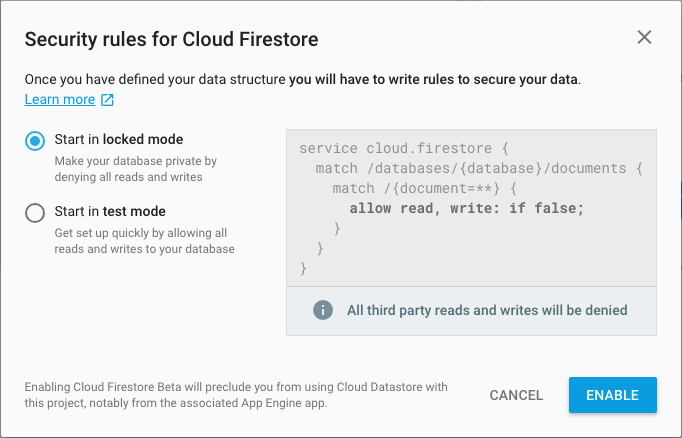
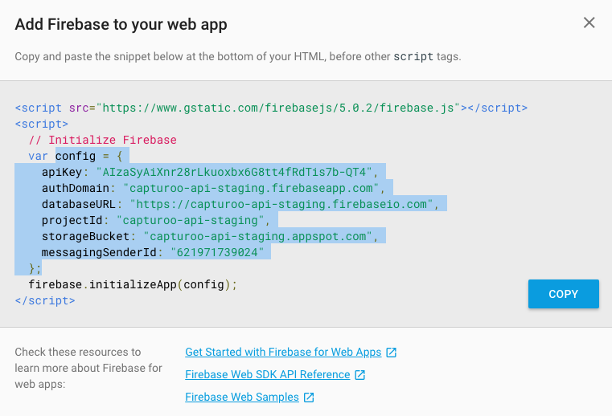
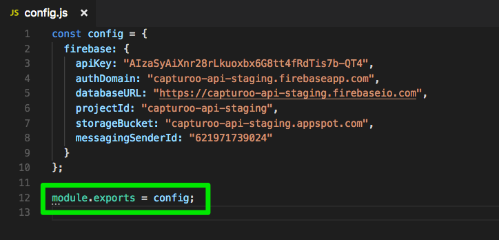

# Leads Dashboard SDK

Internal SDK for Dashboard

## Quickstart

### Introduction
The Capturoo system, including Authentication (Auth) and Database (Firestore) is hosted on the Firebase platform. This Dashboard SDK (Node.js Client) is used to interface to the underyling Capturoo system without the need to make calls to Firebase directly.

### Create a Cloud Firestore project
If you wish to test from a fresh project follow these instructions.

1. Open the [Firebase Console](https://console.firebase.google.com/) and create a new project.
2. In the **Database section**, click the **Get Started** button for Cloud Firestore.
3. Select a starting mode for your Cloud Firestore Security Rules:
  **Locked mode**
  Denies all reads and writes from mobile and web clients.
  
4. Click **Enable**.
5. Navigate to the capturoo-api repository's function directory and deploy the firestore rules:

```
cd ~/projects/capturoo/capturoo-api/functions
npm run deploy-firestore-rules-staging
```

### Quickstart
Make a new project directory and setup your project. Install the capturoo-dashboard-sdk
```sh
mkdir testproject; cd testproject
npm init
npm install capturoo-dashboard-sdk
```

The Dashboards SDK (Node.js Client) is written using ES7 async/await syntax so maybe need to surround you outermost calls with an asyncronous IIFE.

```javascript
(async () => {
  // your code goes here
})();
```

Since the SDK is a client SDK you will need to initialise it with the Firebase web app config.

Navigate to the Firebase project home.


Select Add Firebase to your web app.



Copy the **config object portion only** and paste this to a `config.js` file in your project. Add the `module.exports = config;` line to ensure your config is exported.



In your project directory write the following code to a file `test.js`. Use the follow code to initiase the SDK, passing the config object to the DashboardSDK client.

```javascript
(async () => {
  const config = require('./config');
  const DashboardSDK = require('capturoo-dashboard-sdk');
  const sdk = new DashboardSDK(config);

  // ...
})();
```

To test your configuration your JavaScript using Node. If there are no errors your configuration is complete.
```sh
node test.js
```

Use the example code for specific usecases. See below.

### Example Code
Examples of how to call the Dasboard SDK (Node.js Client) can be found in the [examples directory](examples/).


## Run Test

```
npm run test
```

For unit testing leads:
```
npm run test ./test/leads.test.js
```


